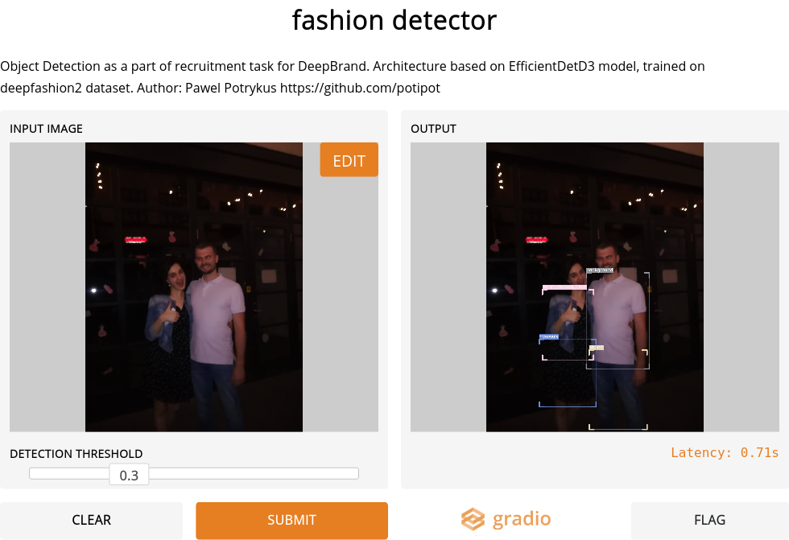

[](https://mybinder.org/v2/gh/potipot/deepfashion/inference?filepath=inference.ipynb)


### Gradio deployment 
https://gradio.app/g/potipot/deepfashion

# howto
to train the model you'll have to download the ds from https://github.com/switchablenorms/DeepFashion2 and place it in the `datasets/train` and `datasets/validation` directory.

The label failes are already cached and should be loaded automatically - check `detector.ipynb` to make sure.

Check the `startup.sh` to see what kind of preprocessing is necessary.

1. Install nvidia apex:
```bash
git clone https://github.com/NVIDIA/apex
cd apex
pip install -v --disable-pip-version-check --no-cache-dir --global-option="--cpp_ext" --global-option="--cuda_ext" ./
```

Make sure your `/usr/local/cuda` points to `cuda-10.2`

2. Create the env
```bash
conda env create -n deepfashion -f environment.yml
```

3. Train
```bash
python detector.py
```

